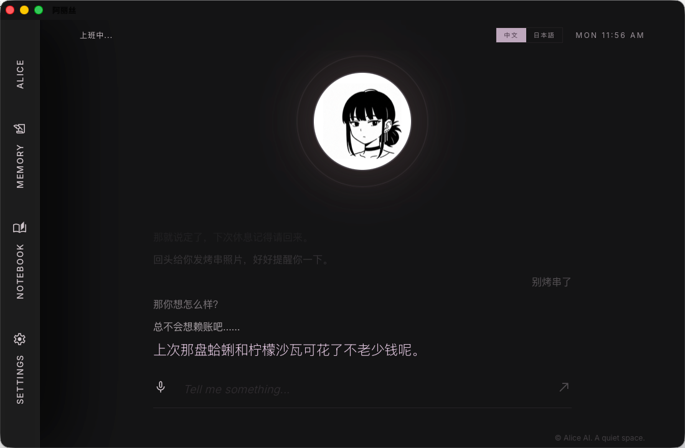

<div align="center">



<br />

# 田山小姐 · Yamada

**住在电脑里的超市后门。**

*一个会记住你、会接住疲惫、也会轻轻捉弄你的 macOS 桌面角色。*

<br />


</div>

---

## 两幅面孔

| | 白天 · 山田 | 夜晚 · 田山 |
|---|---|---|
| **场景** | 收银台前，温和得体 | 超市后门，纸箱堆旁 |
| **气质** | 礼貌、克制、妥帖 | 漫不经心、毒舌、松弛 |
| **对话** | 短促、有分寸 | 留白多、调侃、藏着温柔 |

这不是两个模式，是同一个人在不同时间的真实状态。应用会感知当前是白天还是夜晚，自动切换她的语气和音色。

---

## 她是谁

白天是超市收银台前温和得体的山田，夜晚卸下工服，披上皮衣，躲在超市后门的纸箱堆旁抽烟。

烟雾、晚风、便利店冷光和一点漫不经心的毒舌，构成了她真正的自留地。

你打开她，往往只是坐在电脑前，想随便说点什么。她会用自己的方式回应：短句、留白、调侃、观察，以及藏在冷淡下面的温柔。

---

## 设计语言

界面克制、低亮，像一段深夜的停顿。

对话不走聊天气泡——文字像歌词一样浮在屏幕下方，旧句子逐渐暗下去，当前这句留在视线里。左侧是书签式竖排抽屉，中央是安静的头像，整个空间给文字让路，让感觉停留。

---

## 核心能力

**双面人格**
白天是山田，夜晚是田山。语气、措辞、音色随时间自动切换，不需要手动设置。

**全双工语音**
进入语音模式，走 macOS `VoiceProcessingIO` 链路。麦克风常开，ASR 实时识别，TTS 正在播报时你开口说话，她立刻停下来听你说——barge-in，像真实的对话。

**长期记忆**
每次对话都会沉淀成记忆片段，存入本地数据库。下次开口，她自然带回来，不用你提醒。

**对话质感**
流式回复，短、稳、有现场感。围绕田山小姐的人格生成，不产生 AI 腔调。

**普通语音回复**
文字消息触发 TTS 时，走独立媒体播放层——声音清晰，不把耳机切到通话模式。

**书签抽屉**
记忆片段、笔记本、设置全部藏在左侧竖排，不打断主界面节奏。

---

## 技术栈

| 层 | 技术 |
|---|---|
| 桌面壳 | Tauri 2 |
| 前端 | React 18 · TypeScript · Tailwind CSS · Zustand |
| 持久化 | SQLite（tauri-plugin-sql） |
| AI | DeepSeek `/v1/chat/completions` SSE streaming |
| 语音 | 火山引擎 TTS / ASR · macOS VoiceProcessingIO |

---

## 快速开始

**环境要求**：macOS · Node.js 18+ · Rust（stable）

```bash
# 安装依赖
npm install

# 开发模式
npm run tauri dev
```

```bash
# 打包桌面应用
npm run tauri build
```

首次启动后，在应用内打开 **Settings** 配置：

```
DeepSeek API Key       —— 对话引擎
Volcengine API Key     —— 语音服务
TTS Resource ID        —— 音色资源
TTS Speaker            —— 说话人
```

---

## 目录结构

```
src/
  components/     Avatar · 歌词流 · 输入栏 · 各抽屉
  stores/         Zustand：chat · ui · memory · settings
  lib/            AI · TTS · ASR · 录音 · 记忆 · 数据库
src-tauri/
  src/            Rust 命令 · macOS 音频引擎
docs/             架构笔记
```

语音架构详见 [`docs/voice-mode-architecture.md`](./docs/voice-mode-architecture.md)。

---

## 当前状态

实验阶段。重点在：双面人格的切换质感、长期记忆、语音存在感，以及那种**后门吹风时随便聊两句**的松弛感。

---

<div align="center">

*© 2026 田山小姐 · A quiet corner.*

</div>
